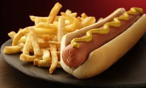
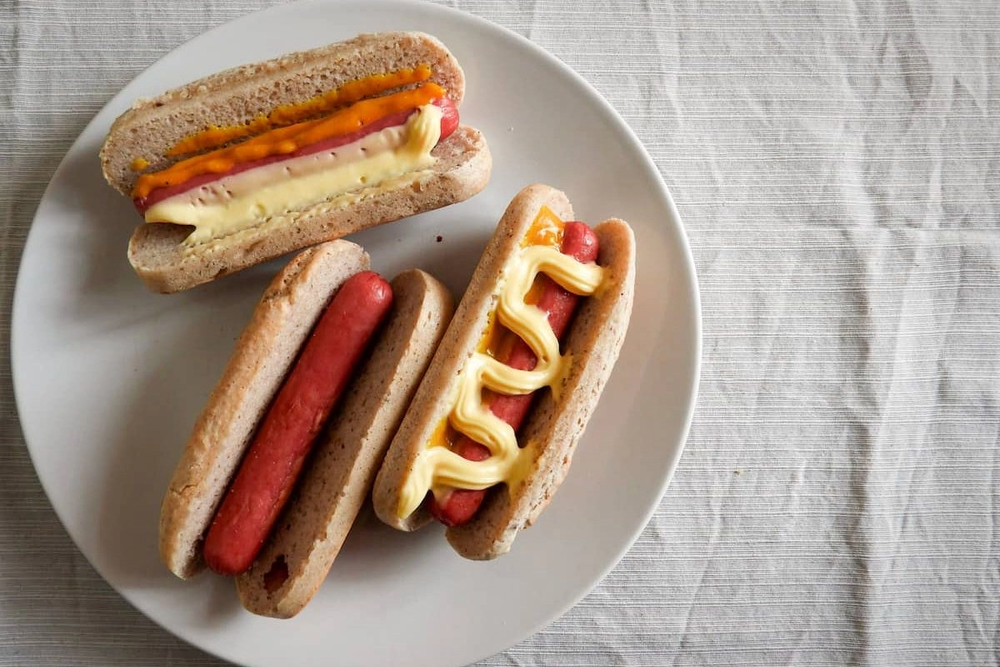
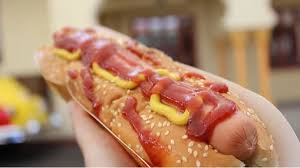
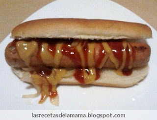

### Como hacer un buen pancho

### para empezar un pancho necesitas los ingredientes. Aca te dejo dos listas con sus respectivos o posibles ingredientes

## ingredientes

- salchicha (de ser posible de origen aleman) 
- pan de pancho (el que mas te guste o el que tengas a mano)

## condimentos

- ketchup
- mayonesa
- mostaza
- chimichurri 
- sala cheddar
- papas pay 

### abajo te dejamos unos links con recetas de panchos

https://cookpad.com/ar/buscar/super%20panchos

https://www.clarin.com/entremujeres/bienestar/panchos-comida-rapida-rincon-gourmet-gourmet-hot-dog_0_ByqYoaFPQe.html

https://www.eldestapeweb.com/atr/recetas-de-cocina/como-hacer-el-mejor-pancho-casero-la-receta-completa-20234259230

https://www.googleadservices.com/pagead/aclk?sa=L&ai=DChcSEwji7YfJrJWGAxWGXUgAHS67BNwYABAAGgJjZQ&ase=2&gclid=Cj0KCQjwgJyyBhCGARIsAK8LVLOvzoqVPg4Ty88oU5OZwjx5d2gYu7LQN8kZ0K_QKF2A4q3DFZt_kgcaAqozEALw_wcB&ohost=www.google.com&cid=CAESVuD2vfBP3m0RI5AN283pC8mEw1IJK-Dw4Nyp3IB8u7HYI1yu9SQxlaaOXg1FKVOJfjYgDHA83F8KYzY3eVzxI0p0SdWGAsseJv-aAIpt6R12heSiviwY&sig=AOD64_0jn2NGexiKMXA93FcMFT9iBddnmw&q&nis=4&adurl&ved=2ahUKEwjSloLJrJWGAxWoqpUCHZuRCQMQ0Qx6BAgKEAE

https://www.clarin.com/gourmet/panchos-gustos-opciones-imperdibles-probar-buenos-aires_0_9hHQPyrVvt.html

### aca abajo de te dejamos una par de imagenes de panchos para que uses de referencia

